

# RESQNET

### Emergency Communication for Connectivity-Limited Environments

RESQNET is an emergency communication and coordination platform designed to support users when conventional communication infrastructure is unavailable, disrupted, or unreliable.

The platform provides access to emergency communication, SOS and alert capabilities, assistance requests, community coordination, emergency resources, and other critical information through a unified mobile experience.

---

## About RESQNET

RESQNET is an offline-first emergency communication platform designed to support communication when conventional Internet connectivity is unavailable or disrupted.

RESQNET uses **Bluetooth Low Energy (BLE)**, **store-and-forward communication**, and **multi-hop message relay** to allow nearby RESQNET devices to exchange emergency information.

The platform is designed for emergency and disaster-response scenarios where conventional communication infrastructure may be unavailable, unreliable, or disrupted.

---

## Key Features

- Emergency SOS broadcasting
- Emergency Alert creation and distribution
- Request Help
- Volunteer Network
- Offline emergency communication
- Bluetooth Low Energy communication
- Multi-hop message relay
- Store-and-forward messaging
- Private messaging
- Community Centre broadcasts
- Missing-person reporting
- Safe-location sharing
- Offline maps
- Contact exchange
- Message encryption and authentication
- Duplicate-message protection
- Message TTL and expiry controls

---

# Application Preview

## Dashboard

  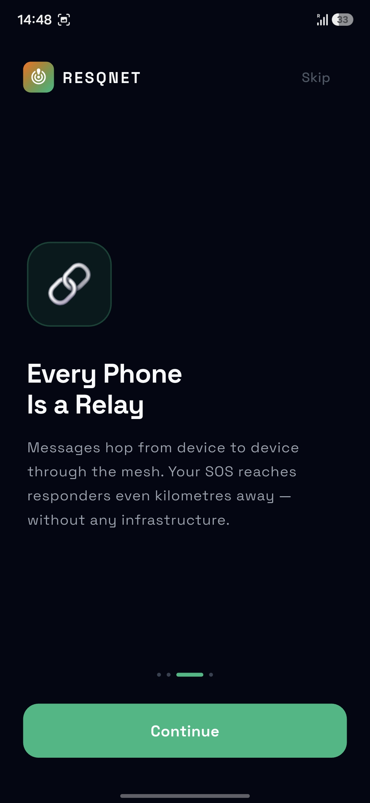
  &nbsp;&nbsp;
  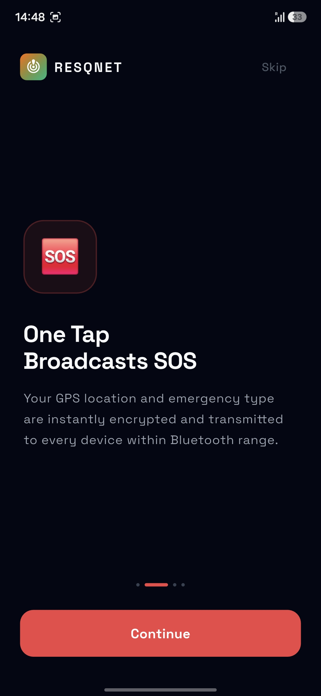
  &nbsp;&nbsp;
  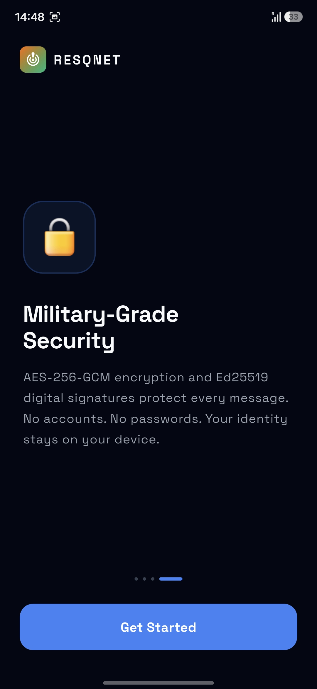

  <b>Emergency Dashboard & Core RESQNET Features</b>

---

## Emergency Alerts

RESQNET enables users to create and distribute emergency alerts through participating devices.

  
  &nbsp;
  
  &nbsp;
  

---

## SOS Emergency Broadcasting

The SOS feature is designed to distribute emergency information across reachable RESQNET devices.

  
  &nbsp;
  
  &nbsp;
  

---

## Request Help

Users can create help requests containing information needed by nearby participants and volunteers.

  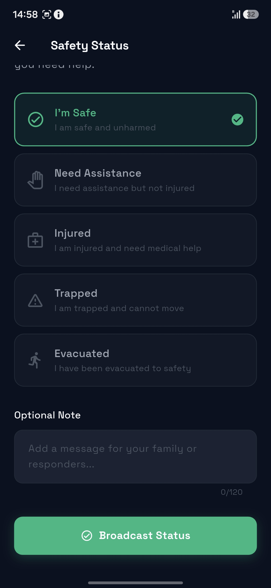
  &nbsp;&nbsp;
  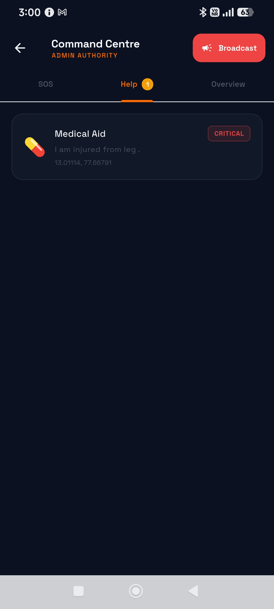
  &nbsp;&nbsp;
  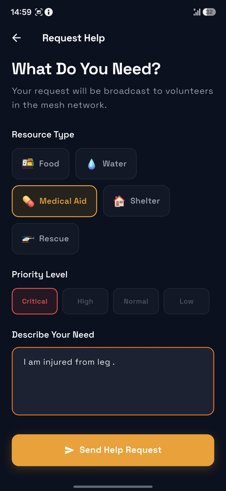

---

## Volunteer Network

RESQNET includes functionality for coordinating volunteers and emergency assistance.

  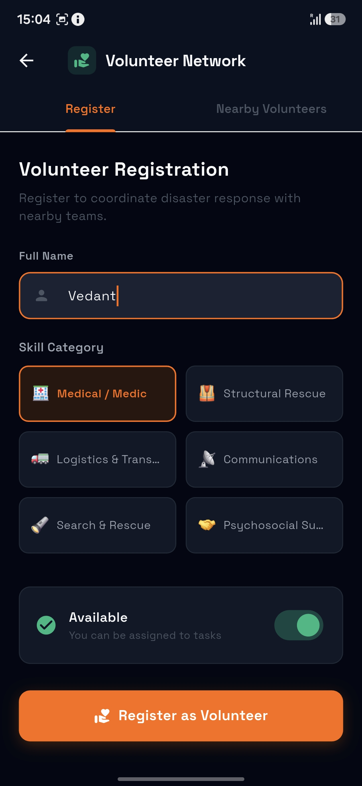
  &nbsp;&nbsp;
  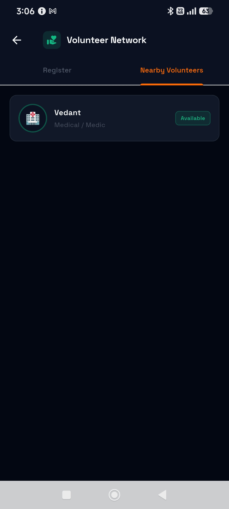

---

## Community Centre

The Community Centre provides a shared space for distributing community information across participating RESQNET devices.

  
  &nbsp;&nbsp;
  

---

## Missing Person Reporting

Missing-person information can be created and distributed through the RESQNET communication network.

  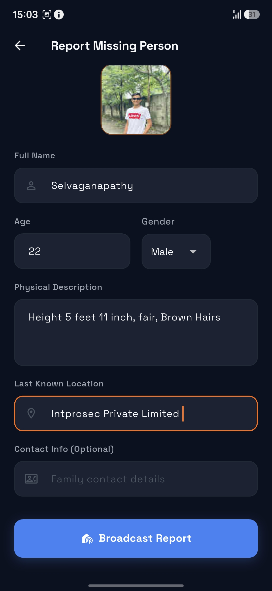
  &nbsp;&nbsp;
  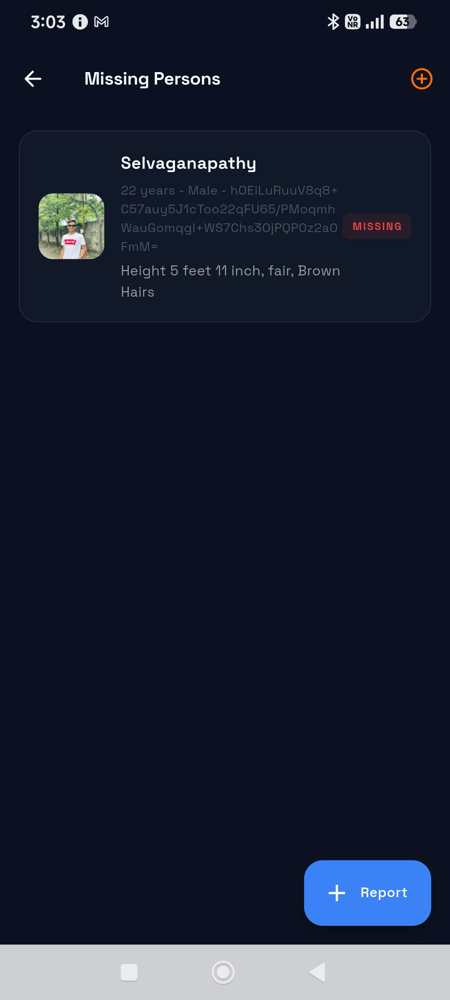
  &nbsp;&nbsp;
  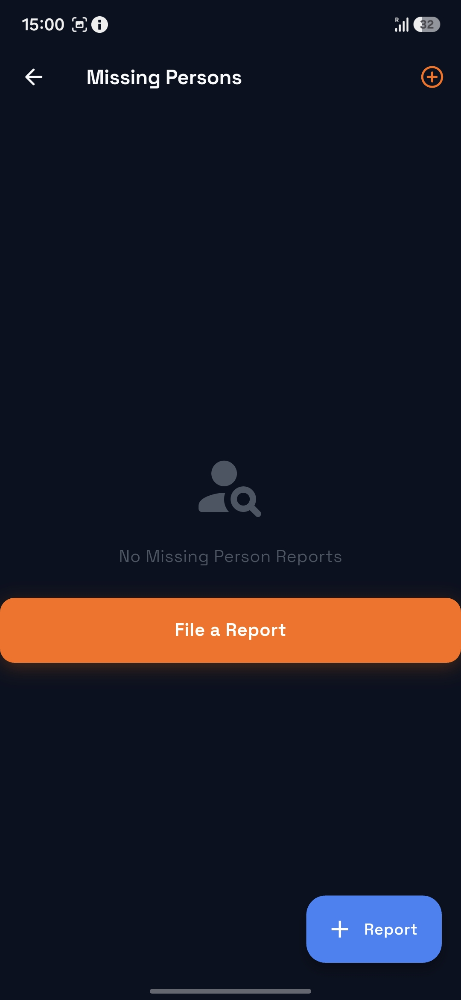

---

## Safe Locations

RESQNET allows important locations such as shelters, hospitals, police stations, relief camps, safe zones, and other emergency resources to be shared.

  
  &nbsp;&nbsp;
  

---

## Contact Exchange

RESQNET provides contact exchange functionality for connecting participating users.

  
  &nbsp;
  
  &nbsp;
  

---

# How RESQNET Works

RESQNET is designed to support communication and access to important information during situations where conventional connectivity may be limited or unavailable.

The platform brings together emergency communication, assistance requests, community information, location-based resources, and related emergency-support capabilities within a unified mobile experience.

  <b>Connect • Communicate • Coordinate • Respond</b>

Specific details regarding RESQNET's communication architecture, message distribution mechanisms, security design, protocols, and internal implementation are proprietary and are not disclosed in this public repository.

---

# Technology

RESQNET is a mobile emergency communication platform developed using modern mobile application technologies.

The system has been designed with a focus on:

- Offline-capable operation
- Emergency communication
- Reliable information exchange
- Mobile accessibility
- Security and privacy
- Resilient operation
- Emergency resource coordination

Detailed information regarding the internal architecture, communication protocols, data-management mechanisms, security implementation, networking design, and infrastructure is proprietary.

---

# Security

RESQNET incorporates application-level cryptographic mechanisms designed to protect:

- Message confidentiality
- Message integrity
- Message authenticity
- Local cryptographic material
- Communication between participating RESQNET devices

Additional communication controls include:

- Unique message identification
- Duplicate-message protection
- Message TTL controls
- Message expiry
- Controlled store-and-forward propagation

Detailed cryptographic implementation, private key material, signing credentials, and internal security mechanisms are intentionally not published in this repository.

---

# Use Cases

RESQNET is intended for communication scenarios where conventional network infrastructure may be unavailable or unreliable, including:

- Disaster-response environments
- Emergency communication
- Network outage scenarios
- Remote or infrastructure-limited environments
- Community emergency coordination
- Volunteer coordination
- Missing-person information distribution
- Emergency resource and safe-location sharing

---

# Source Code

> **RESQNET is proprietary software.**

This repository is maintained as a **public product showcase and documentation repository**.

The production source code, BLE communication implementation, cryptographic implementation, signing credentials, internal application components, and other proprietary implementation details are **not publicly distributed through this repository**.

---

# Project Status

RESQNET is currently under active development, testing, and validation.

Features and interfaces shown in this repository may evolve as development continues.

---

## IntProSec Private Limited

**RESQNET — Offline Emergency Communication**

